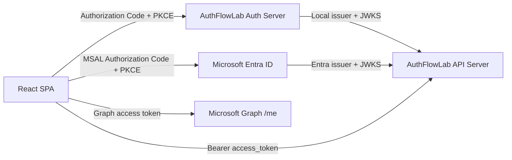
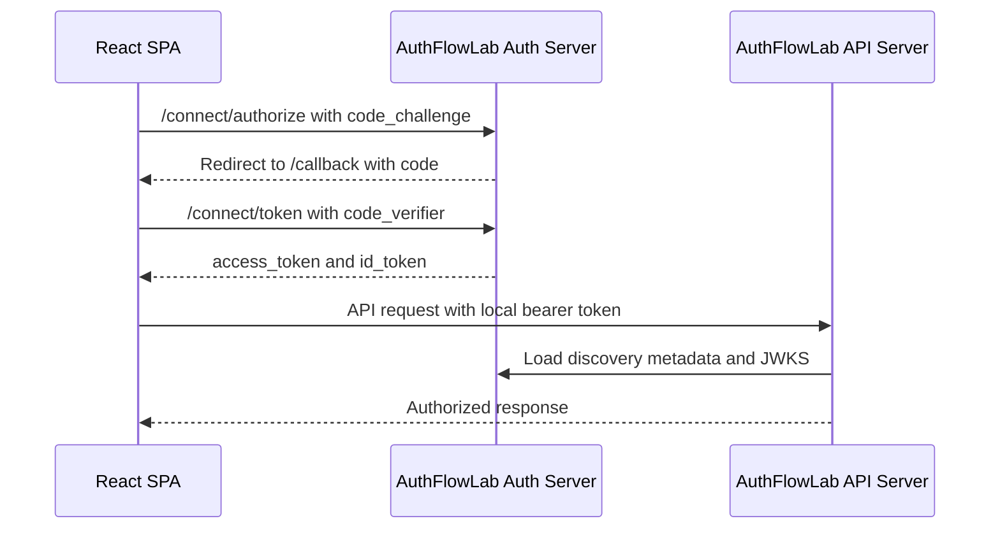
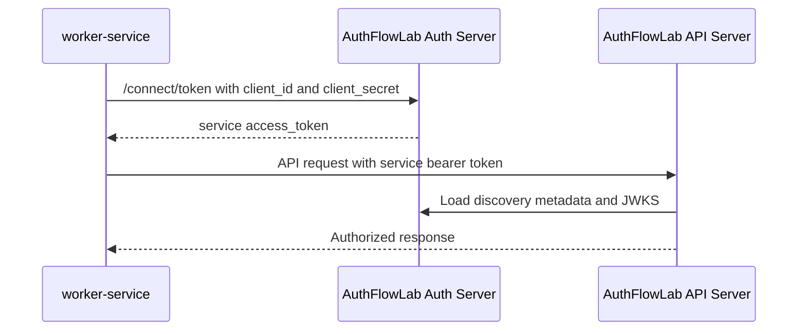
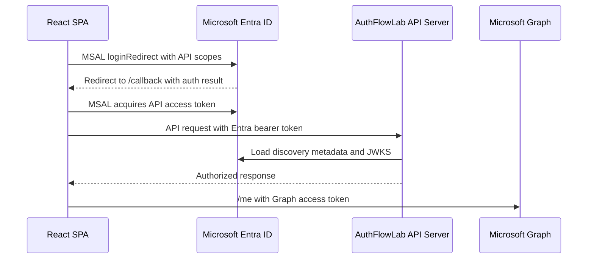

# AuthFlowLab

AuthFlowLab is a full-stack authentication and authorization reference implementation built with ASP.NET Core and React. It demonstrates how a custom authorization server, protected APIs, browser clients, service clients, and Microsoft Entra ID fit together in a standards-based identity architecture.

The project focuses on the parts that matter in production systems: token issuance, JWT validation, discovery metadata, signing keys, delegated user access, service-to-service access, multi-issuer API authentication, and clear resource-server authorization rules.

## What It Covers

- Custom Auth Server with OAuth2 authorization code + PKCE, client credentials, OIDC discovery, UserInfo, and JWKS.
- API Server that validates both local Auth Server JWTs and Microsoft Entra ID access tokens.
- React SPA with local sign-in, MSAL-based Entra sign-in, Token Inspector, and server-side claims inspection.
- Authorization policies for scopes, roles, service tokens, and API keys.
- RSA-backed JWT signing with public-key discovery through JWKS.
- Automated backend tests, frontend build verification, Docker support, and `.http` request samples.

## Architecture



The API Server uses a policy scheme to route bearer tokens to either `LocalJwt` or `EntraJwt`. Local tokens are validated from the Auth Server discovery document and JWKS; Entra tokens are validated from Microsoft discovery metadata and tenant signing keys.

## Key Concepts

| Concept | Purpose |
| --- | --- |
| `access_token` | Sent to the API for authorization. |
| `id_token` | Sent to the client so it can identify the signed-in user. |
| `iss` | Identifies the token issuer. |
| `aud` | Identifies the target API/resource. |
| `scope` / `scp` | Describes delegated API permissions. |
| `roles` | Describes role-based access, commonly used for app roles. |
| JWKS | Publishes public signing keys so APIs can verify JWT signatures. |

## Local vs Entra

| Concept | Local Auth Server | Microsoft Entra ID |
| --- | --- | --- |
| Identity provider | `AuthFlowLab.AuthServer` | Microsoft Entra tenant |
| Browser client | `demo-spa` configured locally | SPA app registration |
| Protected API | `aud=api-server` | API app registration |
| Issuer | Local Auth Server URL | `login.microsoftonline.com` |
| Signing keys | Local JWKS | Microsoft JWKS |
| Scope claim | `scope` | `scp` |
| API validation scheme | `LocalJwt` | `EntraJwt` |

## Flows

Local authorization code + PKCE:



Client credentials:



Entra authorization code + PKCE:



## Run

Docker:

```powershell
docker compose up --build
```

Local backend:

```powershell
dotnet run --project backend\AuthFlowLab.AuthServer\AuthFlowLab.AuthServer.csproj --urls http://127.0.0.1:5001
dotnet run --project backend\AuthFlowLab.ApiServer\AuthFlowLab.ApiServer.csproj --urls http://127.0.0.1:5002
```

Local frontend:

```powershell
cd frontend\AuthFlowLab.Web
npm install
npm run dev
```

Open `http://localhost:5173`.

## Test Identities

| Type | Identifier | Secret | Access |
| --- | --- | --- | --- |
| User | `user` | `user123` | `content.read` |
| User | `admin` | `admin123` | `content.read content.write`, `Admin` role |
| Client | `worker-service` | `worker-secret` | `content.read content.write` |
| SPA | `demo-spa` | none | `openid profile content.read content.write` |
| API key | `internal-tool` | `dev-api-key-123` | `X-Api-Key` |

These are development credentials for the local environment. Do not use committed secrets for production systems.

## Entra ID

The repository uses local demo Microsoft Entra registrations for a protected API and a browser SPA:

| Purpose | Name | Client ID |
| --- | --- | --- |
| Protected API | `AuthFlowLab API` | `b5b7fdde-0835-4e46-863d-463b1432e9f7` |
| Browser SPA | `AuthFlowLab SPA` | `35b46efc-ba76-4940-bc2a-a4fa1b904dcb` |

| Setting | Value |
| --- | --- |
| Tenant | `976c3c85-e425-4880-a658-3653df9cebf2` |
| Redirect URI | `http://localhost:5173/callback` |
| API scopes | `access_as_user`, `write_as_user` |

The API accepts local `content.read` / `content.write` scopes and Entra `access_as_user` / `write_as_user` scopes for the corresponding read and write endpoints.

## API Surface

| Endpoint | Authorization |
| --- | --- |
| `GET /content/public` | Anonymous |
| `GET /content/user` | Any valid bearer token |
| `GET /content/me` | Current authentication state and claims |
| `GET /content/admin` | `Admin` role |
| `GET /content/read` | Local `content.read` or Entra `access_as_user` |
| `POST /content/write` | Local `content.write` or Entra `write_as_user` |
| `GET /content/service` | `token_type=service` |
| `GET /content/api-key` | Valid `X-Api-Key` header |

HTTP request examples are available in:

- `backend/AuthFlowLab.http`
- `backend/AuthFlowLab.AuthServer/AuthFlowLab.AuthServer.http`
- `backend/AuthFlowLab.ApiServer/AuthFlowLab.ApiServer.http`

## Verify

```powershell
dotnet test backend\AuthFlowLab.sln

cd frontend\AuthFlowLab.Web
npm run build
```

## Code Map

Auth Server:

- `backend/AuthFlowLab.AuthServer/Controllers/AccountController.cs` owns the local sign-in page and HTTP-only login cookie.
- `backend/AuthFlowLab.AuthServer/Controllers/ConnectController.cs` owns `/connect/authorize`, `/connect/token`, UserInfo, PKCE validation, scope checks, and code exchange.
- `backend/AuthFlowLab.AuthServer/Controllers/DiscoveryController.cs` exposes OIDC discovery metadata and JWKS.
- `backend/AuthFlowLab.AuthServer/Services/JwtService.cs` signs user access tokens, service access tokens, and OIDC ID tokens.

API Server:

- `backend/AuthFlowLab.ApiServer/Program.cs` configures local JWT validation, Entra JWT validation, API-key authentication, and authorization policies.
- `backend/AuthFlowLab.ApiServer/Controllers/ContentController.cs` defines the protected endpoint matrix.
- `backend/AuthFlowLab.ApiServer/Authentication/ApiKeyAuthenticationHandler.cs` validates `X-Api-Key`.

Frontend:

- `frontend/AuthFlowLab.Web/src/auth.ts` handles local PKCE, callback exchange, nonce validation, MSAL login, and token acquisition.
- `frontend/AuthFlowLab.Web/src/App.tsx` coordinates login state, API calls, Graph calls, and logout.
- `frontend/AuthFlowLab.Web/src/components/TokenPanel.tsx` displays decoded JWT fields and raw tokens for inspection.
- `frontend/AuthFlowLab.Web/src/config.ts` centralizes local URLs, client id, redirect URI, scopes, and storage keys.
