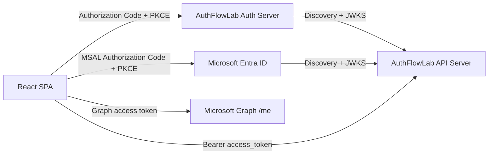

# AuthFlowLab

A minimal authentication and authorization lab for learning JWT bearer validation and OAuth2-style flows.

## Current Scope

- User login issues JWT access tokens.
- Client credentials uses the OAuth2-style `/connect/token` endpoint.
- Authorization code + PKCE issues user access tokens through `/connect/authorize` and `/connect/token`.
- Auth Server exposes OpenID Connect discovery metadata and JWKS.
- API Server validates JWTs signed by Auth Server.
- API Server can also validate Entra ID access tokens for the configured tenant/API scope.
- API endpoints demonstrate anonymous, authenticated, role, scope, service-only, and API-key authorization.

## Architecture

Frontend -> Auth Server -> API

Entra mode:

Frontend -> Entra ID -> API



For the current lab stage:

- Auth Server signs JWTs with `keys/private.key` when the file exists.
- If no private key file exists, Auth Server generates an ephemeral RSA key for the current process.
- Auth Server exposes its public signing key through JWKS, so a separate `public.key` file is not required.
- API Server uses `Jwt:Authority` to load discovery metadata and JWKS automatically.
- API Server uses `Jwt:Entra:Authority` and `Jwt:Entra:Audience` to validate Microsoft Entra ID tokens.
- User accounts, client credentials, allowed scopes, and token lifetime are configured in `AuthFlowLab.AuthServer/appsettings.json`.

## Entra ID Configuration

The repo is configured for these local lab registrations:

| Purpose | Name | Client ID |
| --- | --- | --- |
| Protected API | `AuthFlowLab API` | `b5b7fdde-0835-4e46-863d-463b1432e9f7` |
| Browser SPA | `AuthFlowLab SPA` | `35b46efc-ba76-4940-bc2a-a4fa1b904dcb` |

Tenant:

```text
976c3c85-e425-4880-a658-3653df9cebf2
```

API delegated scope:

```text
api://b5b7fdde-0835-4e46-863d-463b1432e9f7/access_as_user
api://b5b7fdde-0835-4e46-863d-463b1432e9f7/write_as_user
```

SPA redirect URI:

```text
http://localhost:5173/callback
```

The frontend uses MSAL for Entra ID. The API accepts either the local `content.read` scope or the Entra `access_as_user` scope on `GET /content/read`; it accepts either local `content.write` or Entra `write_as_user` on `POST /content/write`.

To enable Entra write access in Azure:

1. Open `AuthFlowLab API` -> `Expose an API`.
2. Add delegated scope `write_as_user`.
3. Open `AuthFlowLab SPA` -> `API permissions`.
4. Add permission `AuthFlowLab API / write_as_user`.
5. Grant consent if your tenant requires it.

## What This Demonstrates

- OAuth2 `client_credentials` for service-to-service tokens.
- OAuth2 Authorization Code + PKCE for browser login.
- OIDC `id_token`, discovery metadata, JWKS, nonce, and UserInfo.
- JWT access token validation with issuer, audience, lifetime, signature, role, and scope checks.
- Local RSA signing key usage and public-key discovery through JWKS.
- API authorization levels: anonymous, authenticated, role, scope, service-only, and API key.
- Microsoft Entra ID integration with MSAL and Microsoft Graph.
- The distinction between authentication failures (`401`) and authorization failures (`403`).

## Run With Docker

From the repository root:

```powershell
# 中文注释: 构建并启动前端、认证服务器和 API 服务器。
docker compose up --build
```

Open:

```text
# 中文注释: Docker 一键启动后的前端地址。
http://localhost:5173
```

Stop the stack:

```powershell
# 中文注释: 停止并移除 Docker Compose 启动的容器。
docker compose down
```

## Run Locally

From the repository root:

```powershell
# 中文注释: 分别启动认证服务器和 API 服务器。
dotnet run --project backend\AuthFlowLab.AuthServer\AuthFlowLab.AuthServer.csproj --urls http://127.0.0.1:5001
dotnet run --project backend\AuthFlowLab.ApiServer\AuthFlowLab.ApiServer.csproj --urls http://127.0.0.1:5002
```

Frontend:

```powershell
# 中文注释: 进入前端项目目录，安装依赖并启动开发服务器。
cd frontend\AuthFlowLab.Web
npm install
npm run dev
```

Open:

```text
# 中文注释: 打开前端开发服务器地址。
http://localhost:5173
```

## Test Users And Clients

Users:

| Username | Password | Role  | Scope        |
| --- | --- | --- | --- |
| `user` | `user123` | `User` | `content.read` |
| `admin` | `admin123` | `Admin` | `content.read content.write` |

Client:

| Client ID | Client Secret | Scope |
| --- | --- | --- |
| `worker-service` | `worker-secret` | `content.read content.write` |
| `demo-spa` | none | `openid profile content.read content.write` |

These are lab credentials. Do not use committed secrets for real systems.

API key:

| Name | Header | Value |
| --- | --- | --- |
| `internal-tool` | `X-Api-Key` | `dev-api-key-123` |

The API key is a lab credential configured on the API Server. It is not an OAuth2/OIDC grant type.

## Auth Server API

### Login

```http
# 中文注释: 使用用户名和密码登录并获取访问令牌。
POST http://127.0.0.1:5001/auth/login
Content-Type: application/json

{
  "username": "user",
  "password": "user123"
}
```

Response:

```jsonc
// 中文注释: 登录成功后返回的访问令牌响应示例。
{
  "access_token": "<jwt>",
  "token_type": "Bearer",
  "expires_in": 1800,
  "scope": "content.read"
}
```

Invalid credentials return:

```jsonc
// 中文注释: 用户名或密码无效时返回的错误响应示例。
{
  "error": "invalid_grant",
  "error_description": "The username or password is invalid."
}
```

### Client Credentials Token

```http
# 中文注释: 使用客户端凭据模式为服务客户端获取访问令牌。
POST http://127.0.0.1:5001/connect/token
Content-Type: application/x-www-form-urlencoded

grant_type=client_credentials
&client_id=worker-service
&client_secret=worker-secret
&scope=content.read content.write
```

The response shape is the same as login. Invalid clients return `invalid_client`; unsupported grant types return `unsupported_grant_type`; disallowed scopes return `invalid_scope`.

The old lab-only `/auth/client-token` endpoint has been removed. Service tokens now use the OAuth2-style `/connect/token` endpoint.

### Authorization Code + PKCE And OIDC

The SPA starts the authorization request without sending a password. If the user is not signed in, Auth Server shows its own login page, creates an HTTP-only login cookie, and then redirects back to the original authorize request.

When the request includes `openid`, Auth Server also returns an OIDC `id_token`. The `access_token` is for API access; the `id_token` is for the client application to know who logged in.

Start the authorization request:

```http
# 中文注释: 发起授权码加 PKCE 的授权请求。
GET http://127.0.0.1:5001/connect/authorize?response_type=code&client_id=demo-spa&redirect_uri=http%3A%2F%2F127.0.0.1%3A5173%2Fcallback&scope=openid%20profile%20content.read&state=demo-state&nonce=demo-nonce&code_challenge=mvtzfCbIJ5YDPp1UVYfCnz2ZSvRrCEUgWtyrhVS6xo8&code_challenge_method=S256
```

The browser frontend requests `openid profile content.read content.write`. Auth Server grants only the intersection of requested scopes, client scopes, and user scopes. For example, `user` receives `content.read`, while `admin` receives `content.read content.write`.

For this example:

```text
# 中文注释: PKCE 示例中的 verifier、challenge 和 nonce。
code_verifier = demo-code-verifier-1234567890
code_challenge = mvtzfCbIJ5YDPp1UVYfCnz2ZSvRrCEUgWtyrhVS6xo8
nonce = demo-nonce
```

The response redirects to the registered callback URL with `code` and `state`:

```text
# 中文注释: 授权服务器会重定向回前端回调地址并携带 code 和 state。
http://127.0.0.1:5173/callback?code=<authorization-code>&state=demo-state
```

Exchange the code for a user access token:
Because the original scope included `openid`, the response also includes `id_token`.

```http
# 中文注释: 使用授权码和 code_verifier 交换用户访问令牌。
POST http://127.0.0.1:5001/connect/token
Content-Type: application/x-www-form-urlencoded

grant_type=authorization_code
&client_id=demo-spa
&code=<authorization-code>
&redirect_uri=http://127.0.0.1:5173/callback
&code_verifier=demo-code-verifier-1234567890
```

Call UserInfo with the returned access token:

```http
# 中文注释: 使用访问令牌调用 UserInfo 端点。
GET http://127.0.0.1:5001/connect/userinfo
Authorization: Bearer <access-token>
```

### Discovery And JWKS

```http
# 中文注释: 获取 OpenID Connect discovery 元数据。
GET http://127.0.0.1:5001/.well-known/openid-configuration
```

The discovery document includes the issuer, token endpoint, JWKS URI, supported grant types, and supported scopes.

```http
# 中文注释: 获取用于验证 JWT 签名的 JWKS 公钥文档。
GET http://127.0.0.1:5001/.well-known/jwks.json
```

The JWKS document exposes the RSA public key used by API servers to verify JWT signatures.

## API Server Endpoints

| Endpoint | Authorization |
| --- | --- |
| `GET /content/public` | Anonymous |
| `GET /content/user` | Any valid bearer token |
| `GET /content/admin` | `Admin` role |
| `GET /content/read` | Local `content.read` scope or Entra `access_as_user` scope |
| `POST /content/write` | Local `content.write` scope or Entra `write_as_user` scope |
| `GET /content/service` | `token_type=service` |
| `GET /content/api-key` | Valid `X-Api-Key` header |

Example:

```http
# 中文注释: 使用访问令牌调用需要 content.read scope 的 API。
GET http://127.0.0.1:5002/content/read
Authorization: Bearer <access_token>
```

API key example:

```http
# 中文注释: 使用 X-Api-Key 请求头调用 API Key 保护的端点。
GET http://127.0.0.1:5002/content/api-key
X-Api-Key: dev-api-key-123
```

## HTTP Examples

Use these files with Visual Studio, Rider, or the REST Client extension:

- `backend/AuthFlowLab.http` contains the full Auth Server + API Server flow.
- `backend/AuthFlowLab.AuthServer/AuthFlowLab.AuthServer.http` contains Auth Server requests.
- `backend/AuthFlowLab.ApiServer/AuthFlowLab.ApiServer.http` contains API Server requests.

Keep shared `.http` files token-free. If you want to store personal tokens locally, create a file such as `backend/AuthFlowLab.local.http`; `*.local.http` is ignored by Git.

## Tests

```powershell
# 中文注释: 运行后端解决方案中的测试。
dotnet test backend\AuthFlowLab.sln
```

Frontend build:

```powershell
# 中文注释: 进入前端项目目录并执行生产构建。
cd frontend\AuthFlowLab.Web
npm run build
```

## Repository Notes

- `keys/*.key` is ignored by Git. Keep private signing keys local.
- `keys/public.key` is not needed because JWKS is generated from the active signing key.
- `frontend/AuthFlowLab.Web/package-lock.json` is committed on purpose. This is an application, and the lock file keeps `npm ci` and Docker builds reproducible.
- Build output such as `bin/`, `obj/`, `node_modules/`, `dist/`, and `*.tsbuildinfo` is ignored.

## Key Code Map

Auth Server:

- `backend/AuthFlowLab.AuthServer/Program.cs` wires CORS, cookie authentication, authorization, Swagger, and controllers.
- `backend/AuthFlowLab.AuthServer/Controllers/AccountController.cs` owns the IdP login page and HTTP-only login cookie.
- `backend/AuthFlowLab.AuthServer/Controllers/ConnectController.cs` owns `/connect/authorize`, `/connect/token`, UserInfo, PKCE validation, scope checks, and code exchange.
- `backend/AuthFlowLab.AuthServer/Controllers/DiscoveryController.cs` exposes OIDC discovery metadata and JWKS.
- `backend/AuthFlowLab.AuthServer/Services/JwtService.cs` signs user access tokens, service access tokens, and OIDC ID tokens.
- `backend/AuthFlowLab.AuthServer/Services/RsaKeyService.cs` loads or generates the RSA signing key and exports the public JWKS key.
- `backend/AuthFlowLab.AuthServer/Services/AuthorizationCodeStore.cs` stores short-lived one-time authorization codes.

API Server:

- `backend/AuthFlowLab.ApiServer/Program.cs` configures local JWT validation, Entra JWT validation, API-key authentication, and authorization policies.
- `backend/AuthFlowLab.ApiServer/Controllers/ContentController.cs` demonstrates anonymous, authenticated, role, scope, service-only, and API-key endpoints.
- `backend/AuthFlowLab.ApiServer/Authentication/ApiKeyAuthenticationHandler.cs` validates `X-Api-Key` locally and creates claims for the API-key policy.

Frontend:

- `frontend/AuthFlowLab.Web/src/auth.ts` generates local PKCE values, starts `/connect/authorize`, exchanges callback `code` for tokens, validates `state`/`nonce`, and uses MSAL for Entra ID login.
- `frontend/AuthFlowLab.Web/src/App.tsx` coordinates login callback handling, API calls, and local logout.
- `frontend/AuthFlowLab.Web/src/components/*` contains the login, session, result, and token display panels.
- `frontend/AuthFlowLab.Web/src/config.ts` centralizes demo URLs, client id, redirect URI, scope, and storage keys.

## Browser Flow

1. Start Auth Server on `http://127.0.0.1:5001`.
2. Start API Server on `http://127.0.0.1:5002`.
3. Start the Vite frontend on `http://localhost:5173`.
4. Open the frontend and click `Local Login`.
5. Auth Server shows its login page if there is no login cookie.
6. Sign in with `user / user123` or `admin / admin123`.
7. Auth Server redirects back to `/callback` with an authorization code.
8. The frontend exchanges the code for `access_token` and `id_token`.
9. Click `Call Read API` to call `GET /content/read` with the access token.
10. Click `Call Write API` to call `POST /content/write`. `user` should receive 403; `admin` should receive 200.
11. Click `UserInfo` to call `GET /connect/userinfo` with the access token.

## Entra Browser Flow

1. Start API Server on `http://127.0.0.1:5002`.
2. Start the Vite frontend on `http://localhost:5173`.
3. Open the frontend and click `Entra Login`.
4. Microsoft Entra ID signs in the tenant user and redirects back to `/callback`.
5. MSAL stores the Entra account/session data in browser session storage.
6. Click `Call Read API` to call `GET /content/read` with the Entra access token.
7. Click `Call Write API` to call `POST /content/write`. It returns 200 only after `write_as_user` is exposed by the API app registration, granted to the SPA app registration, and present in the access token.
8. Click `UserInfo` to call Microsoft Graph `/me` with a Graph access token.
