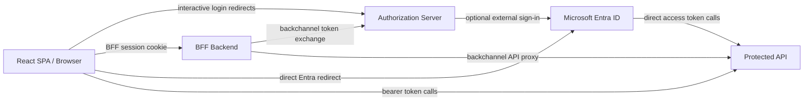
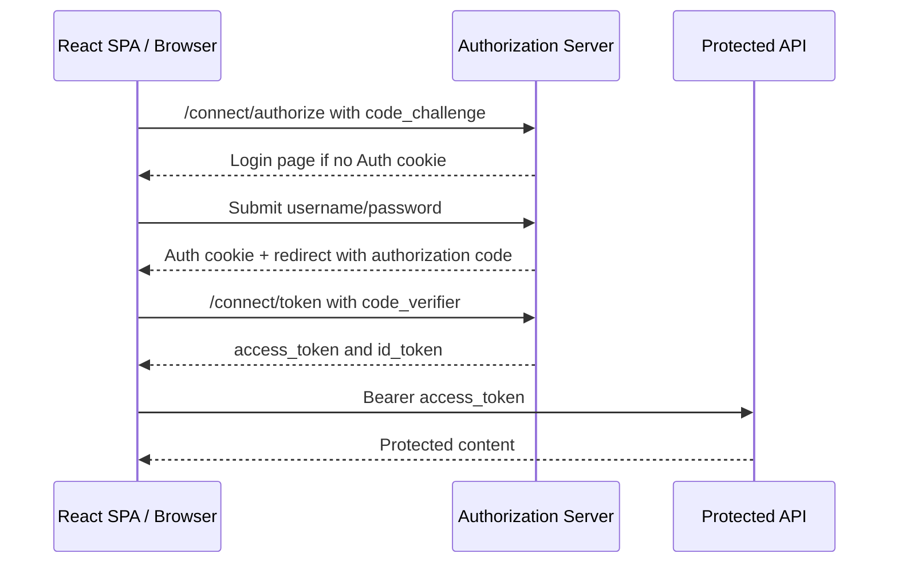
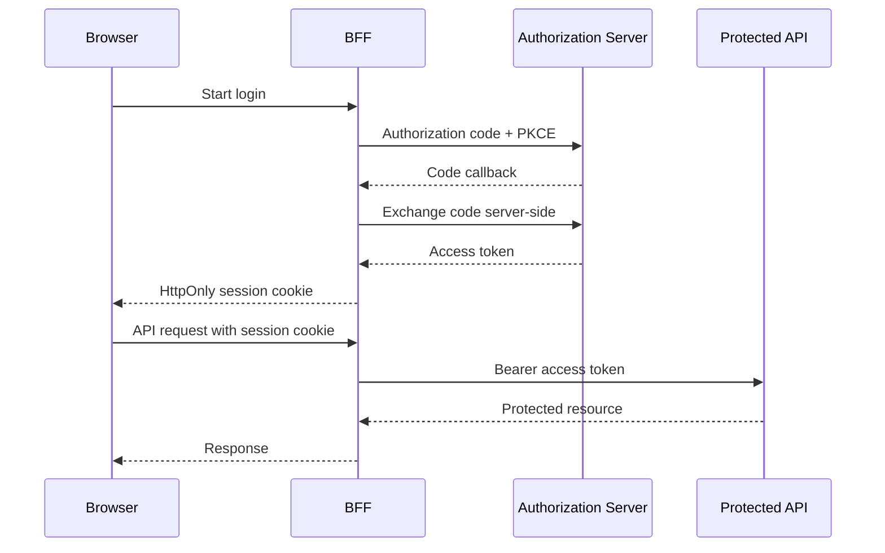
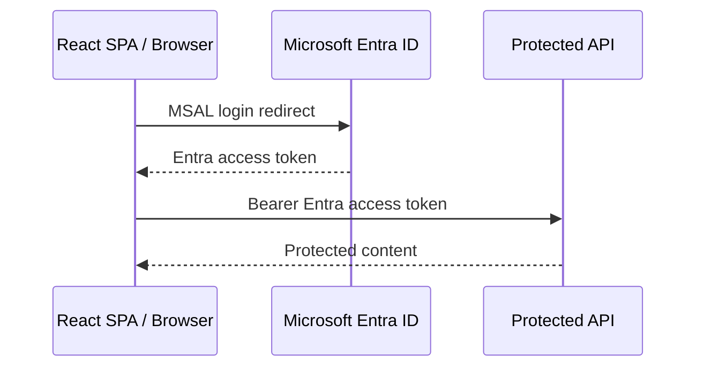
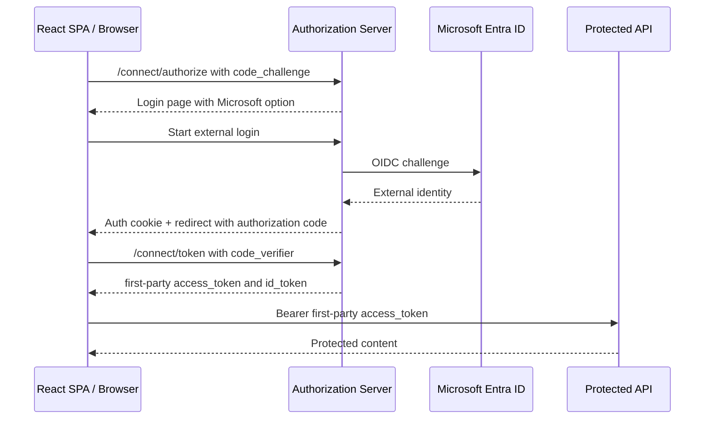
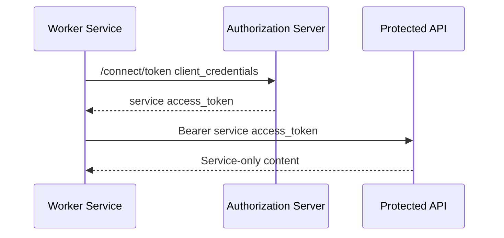

# Identity Platform

Identity Platform is a full-stack identity and access system built with ASP.NET Core and React. It implements a custom OAuth2/OIDC authorization server, protected APIs, browser login, service-to-service access, Microsoft Entra ID federation, and a BFF token-handling model.

The project focuses on enterprise identity boundaries: token issuance, JWT validation, scopes and roles, federated sign-in, browser session protection, API access control, and token handling outside the browser.

## Core Capabilities

- Custom OAuth2/OIDC authorization server with authorization code + PKCE, client credentials, discovery, UserInfo, and JWKS.
- API server accepting both first-party JWTs and direct Microsoft Entra ID access tokens.
- BFF backend that stores access tokens server-side and gives the browser only an HttpOnly session cookie.
- React SPA with local login, federated SSO, direct Entra login, token inspection, and claims inspection.
- Authorization policies for scopes, roles, service tokens, and API keys.
- Backend tests, Docker support, and HTTP request collections.

## Architecture



This diagram is only the component topology. The individual token flows are separated below so the browser-token and BFF-token models do not get mixed together.

## Authentication Flows

| Flow | Purpose | Token used by API |
| --- | --- | --- |
| Local login | First-party browser sign-in | Authorization Server JWT |
| Federated SSO | Entra proves user identity, local system maps permissions | Authorization Server JWT |
| Direct Entra login | SPA uses Entra token directly | Entra access token |
| Client credentials | Service-to-service access | Authorization Server service token |
| BFF login | Browser keeps tokens out of JavaScript | BFF-held access token |

## End-to-End Flows

### Local Login With PKCE



### BFF Login



### Direct Entra Login



### Federated SSO Through Auth Server



### Client Credentials



## Authorization Model

| Access type | Example |
| --- | --- |
| User scopes | `content.read`, `content.write` |
| Roles | `Admin` |
| Service tokens | `token_type=service` |
| Entra scopes | `access_as_user`, optional `write_as_user` |
| API key | `X-Api-Key` for internal tool access |

## Run Locally

Start the full stack:

```powershell
docker compose up --build
```

Run services directly:

```powershell
dotnet run --project backend\EnterpriseIdentityPlatform.AuthServer\EnterpriseIdentityPlatform.AuthServer.csproj --urls http://localhost:5001
dotnet run --project backend\EnterpriseIdentityPlatform.ApiServer\EnterpriseIdentityPlatform.ApiServer.csproj --urls http://localhost:5002
dotnet run --project backend\EnterpriseIdentityPlatform.Bff\EnterpriseIdentityPlatform.Bff.csproj --urls http://localhost:5003
```

Run the web client:

```powershell
cd frontend\EnterpriseIdentityPlatform.Web
npm install
npm run dev
```

Open `http://localhost:5173`.

## Local Credentials

| Type | Identifier | Secret | Access |
| --- | --- | --- | --- |
| User | `user` | `user123` | `content.read` |
| User | `admin` | `admin123` | `content.read content.write`, `Admin` role |
| Client | `worker-service` | `worker-secret` | `content.read content.write` |
| SPA | `demo-spa` | none | `openid profile content.read content.write` |
| BFF | `demo-bff` | `bff-secret` | `openid profile content.read content.write` |
| API key | `internal-tool` | `dev-api-key-123` | `X-Api-Key` |

## Project Structure

```text
backend/
  EnterpriseIdentityPlatform.AuthServer       OAuth2/OIDC server, login, token issuance, JWKS
  EnterpriseIdentityPlatform.ApiServer        protected API and authorization policies
  EnterpriseIdentityPlatform.Bff              server-side token session and CSRF-protected proxy
  *.Tests                                     endpoint and authentication tests
frontend/
  EnterpriseIdentityPlatform.Web              React client for login modes and API inspection
```

## Verify

```powershell
dotnet test backend\EnterpriseIdentityPlatform.sln
cd frontend\EnterpriseIdentityPlatform.Web
npm install
npm run build
```

HTTP examples are available in:

- `backend/EnterpriseIdentityPlatform.http`
- `backend/EnterpriseIdentityPlatform.AuthServer/EnterpriseIdentityPlatform.AuthServer.http`
- `backend/EnterpriseIdentityPlatform.ApiServer/EnterpriseIdentityPlatform.ApiServer.http`
